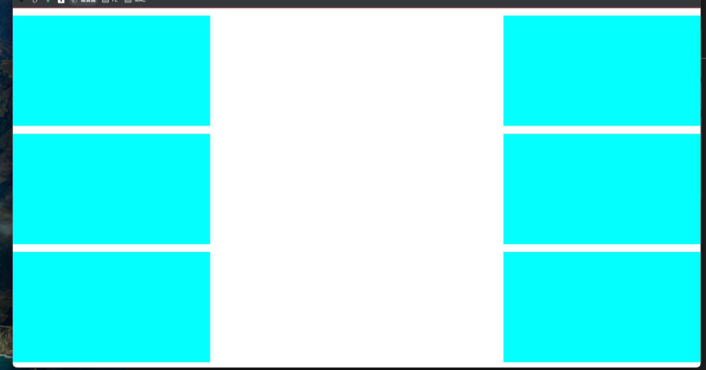
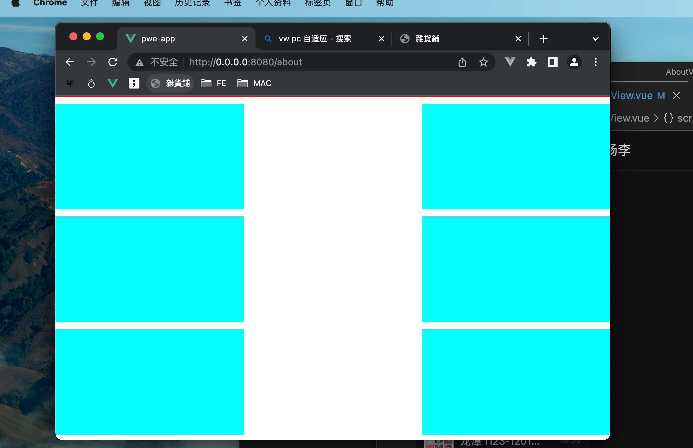
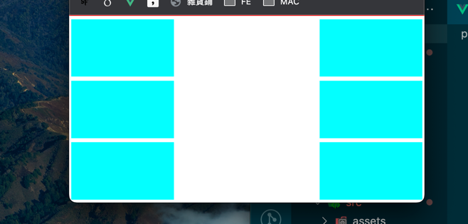

# 基于高度的适配

## 缘起

- 基于百分比的小屏制作
  - 结果不理想
- 基于vw
  - 结果不合适

## 基于 高度适配效果图
### 全屏

### 非全屏

### 小缩放

### 代码
```js
 mounted() {
  this.resizeWeb()
  window.addEventListener('resize', () => {
    this.resizeWeb()
  })
},
methods: {
  resizeWeb() {
    var doc = document.documentElement
    var whdef = (doc.clientHeight / 914) * 1000
    doc.style.fontSize = whdef + 'px' //适用于PC网站
  }
}
```

### 代码注意点
```html 
  914 指的是 浏览器除去浏览器 地址栏， 标签栏， 大约的视窗高度
  * 1000 兼容浏览器（qq浏览器）因为根节点字体如果不扩大那么字体小于14px 那么 rem 不会再缩放
  ps: 字体计算不太好计算, 用rem 计算要 除以1000
```
